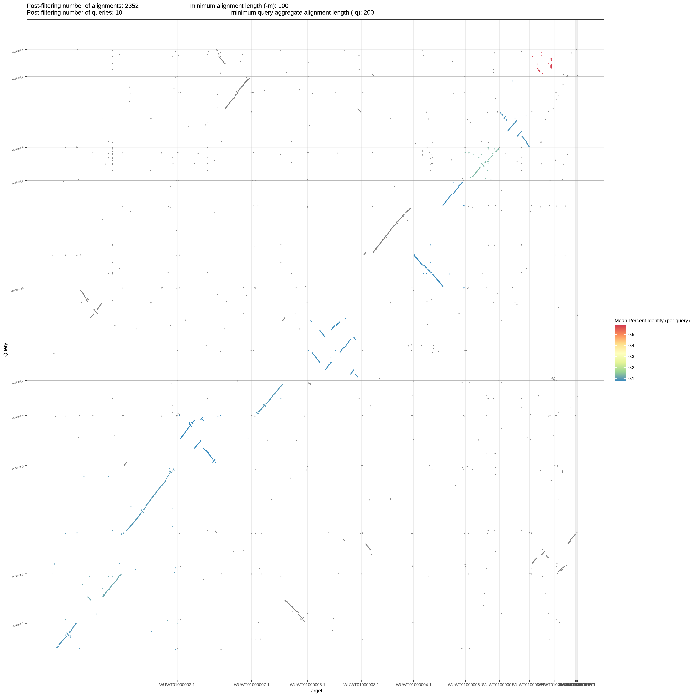
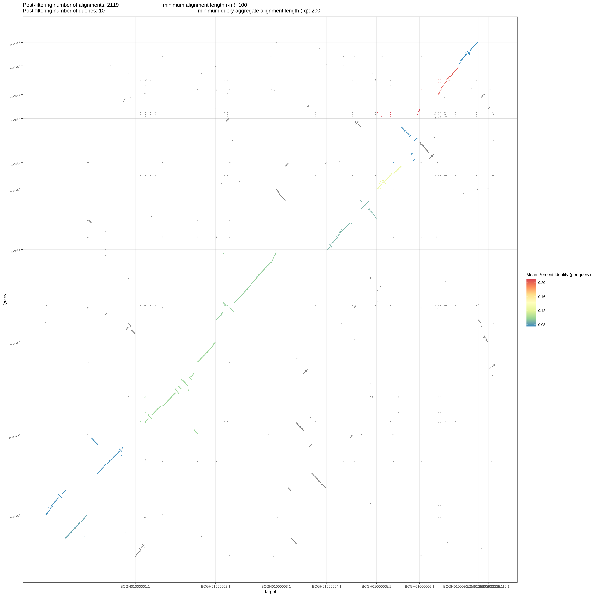
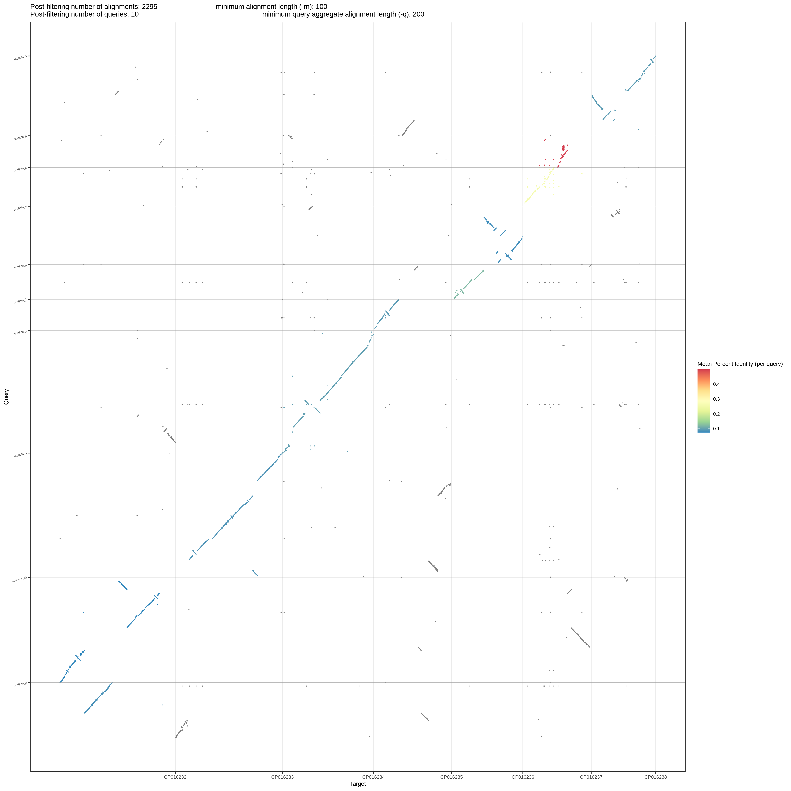
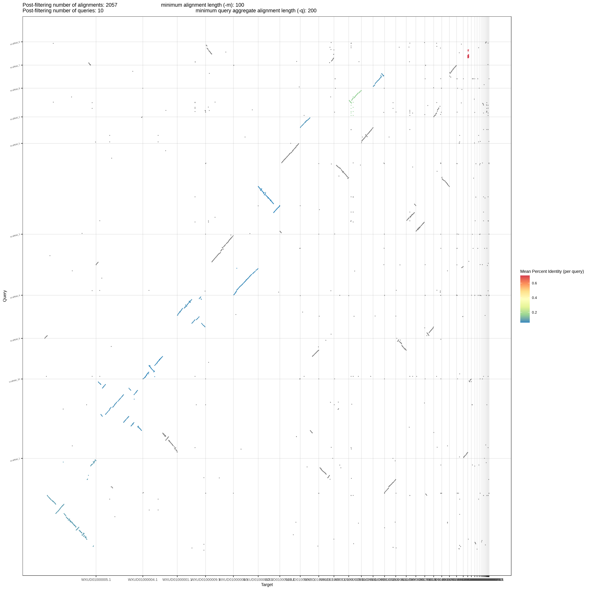

Comparaciones genómicas de la versión LANGEBIO_v3.2.3 vs distintas especies de *Trichoderma*
==========================================================================================

*Trichoderma harzianum*
---------------------

*Trichoderma koningii*
---------------------

*Trichoderma reesei*
---------------------

*Trichoderma* sp
---------------------

