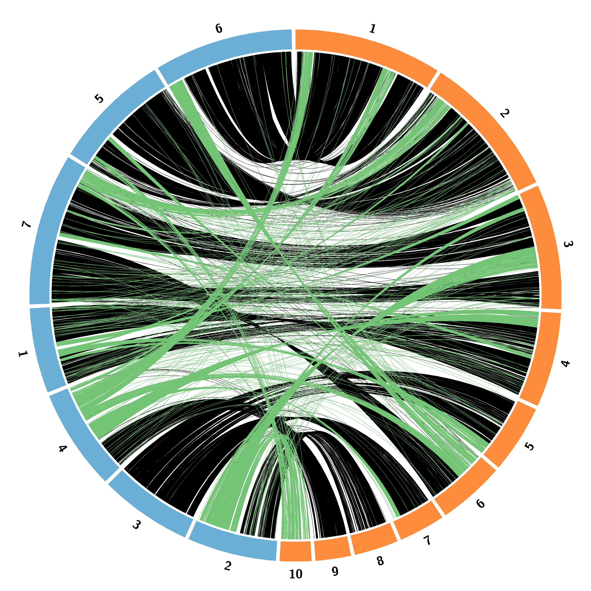

Deteccion de regiones sintenicas entre los genomas de Trichoderma
=================================================================
Genomas analizados
------------------
Con la finalidad de reflejar mejor la presencia de zonas contiguas de similitud a nivel de nucleotidos y de aminoacidos, se eligieron los genomas de Trichoderma que presentaran un buen ensamblaje y que no estuvieran muy fragmentados.

* Trichoderma atroviride IMI206040 [este estudio]
* Trichoderma reesei QM6A [[accn](https://www.ncbi.nlm.nih.gov/assembly/GCA_002006585.1)]
* Trichoderma harzianum T11W [[accn](https://www.ncbi.nlm.nih.gov/Traces/wgs/WUWT01)]
* Trichoderma koningii JCM1883 [[accn](https://www.ncbi.nlm.nih.gov/Traces/wgs/BCGH01)]

No obstante, no existen anotaciones para los genomas mencionados en la version en la que se encuentran. En el caso especifico de Trichoderma reesei se realizo la conversion de coordenadas mediante liftover a partir de las [anotaciones](synteny_files/Trichoderma_reesei_old.gff) depositadas en JGI correspondientes a [87 scaffolds](synteny_files/Trichoderma_reesei_old.fasta) (links a JGI omitidos por mantenimiento del sitio)
```bash
faSplit sequence Trichoderma_reesei_QM6a.fasta 7 new_
for i in $(seq 0 6)
do
	faSplit size new_${i}.fa 3000 new_${i}.split -oneFile -lift=new_${i}
	blat Trichoderma_reesei_old.fasta new_${i}.split.fa -t=dna -q=dna -tileSize=12 -fastMap -minIdentity=95 -noHead -minScore=100 new_${i}.psl
	liftUp -pslQ new_${i}.liftup.psl new_${i} warn new_${i}.psl
	axtChain -linearGap=medium -faQ -faT -psl new_${i}.liftup.psl Trichoderma_reesei_old.fasta Trichoderma_reesei_QM6a.fasta ${i}.chain
done
chainMergeSort *.chain | chainSplit chain_split stdin
faSize Trichoderma_reesei_old.fasta -detailed > Trichoderma_reesei_old.chr_length.txt
faSize Trichoderma_reesei_QM6a.fasta -detailed > Trichoderma_reesei_QM6a.chr_length.txt
mkdir net over
for file_name in $(ls chain_split | grep chain)
do
	chainNet chain_split/$file_name Trichoderma_reesei_old.chr_length.txt Trichoderma_reesei_QM6a.chr_length.txt net/$file_name.net /dev/null
	netChainSubset net/$file_name.net chain_split/$file_name over/$file_name
done
cat over/*.chain > old_new.chain
liftOver -gff Trichoderma_reesei_old.gff old_new.chain Trichoderma_reesei_QM6a.gff unmapped.gff
```
Las anotaciones obtenidas en el archivo [gff de la nueva version](synteny_files/Trichoderma_reesei_QM6A.gff) fueron empleadas para obtener las secuencias codificantes de [dicho genoma](synteny_files/Trichoderma_reesei_QM6A.fasta), y proceder asi a la identificacion de regiones sintenicas con Trichoderma atroviride IMI206040 ([fasta](synteny_files/Trichoderma_atroviride_IMI206040.fasta); [gff](synteny_files/Trichoderma_atroviride_IMI206040.gff))
```bash
gffread -w exons -x Trichoderma_reesei_QM6a.ffn -g Trichoderma_reesei_QM6a.fasta Trichoderma_reesei_QM6a.gff
grep \> exons | perl -pe 's/CDS\=//;s/\>//;s/\ /\t/g;s/\-/\t/g' > transcripts.tsv
for i in $(seq 1 9127)
do
	datablock=$(tail -n+$i transcripts.tsv | head -n1 )
	id=$(echo "$datablock" | cut -f1)
	start=$(echo "$datablock" | cut -f2)
	end=$(echo "$datablock" | cut -f3)
	seqret exons:$id -sbegin $start -send $end fasta::stdout
done > Trichoderma_reesei_QM6a.ffn
transeq -frame 1 Trichoderma_reesei_QM6a.ffn fasta::Trichoderma_reesei_QM6a.faa
#Las secuencias
#mRNA_6681 mRNA_7531 mRNA_4664
#mRNA_3185 mRNA_2351 mRNA_7604
#mRNA_685 mRNA_7042 mRNA_7131
#mRNA_7729 mRNA_1614 mRNA_582
#mRNA_427 mRNA_8017 mRNA_4057
#fueron editadas manualmente para corregir errores introducidos en el proceso de liftover
```
Las secuencias aminoacidicas de ambos genomas fueron comparadas usando orthofinder para seleccionar pares de ortologos
```bash
cd iAdhore
ls
  Trichoderma_atroviride_IMI206040.faa
	Trichoderma_reesei_QM6a.faa
orthofinder -t 12 -a 12 -S blast -f . -n orthofinder
cat OrthoFinder/Results_orthofinder/Orthogroups/Orthogroups.txt | tr " " "\n" | awk -v Family=0 '{if(substr($1,1,2)=="OG") {Family=$1} else {print $0,Family}}' | sed 's/://g' | cat - <(dos2unix Orthogroups_UnassignedGenes.tsv | awk 'NR>1 {print $2,$1}') | tr " " "\t" > ../../../Orthologues.list
```
Posteriormente se creo manualmente el archivo de configuracion [iadhore.mod.ini](synteny_files/iadhore.mod.ini) el cual contiene los siguientes parametros de ejecucion:
```
blast_table=Orthologues.list
table_type=family
prob_cutoff=0.001
anchor_points=4
number_of_threads=12
visualizeAlignment=false
output_path=output_mod
alignment_method=gg2
gap_size=15
cluster_gap=20
level_2_only=true
q_value=0.8
```
De forma paralela se construyeron archivos gff que contuvieran unicamente los ids de las proteinas comparadas para poder obtener las coordenadas de los listones para circos.
Tras la ejecucion de iadhore, se obtuvieron [17315 segmentos](synteny_files/segments.txt), no obstante muchos de ellos corresponden a regiones duplicadas, por lo que los listones creados para circos a partir de este archivo podrian ser muy redundantes, para solucionar lo anterior se construyo la siguiente funcion que permite limpiar el archivo, conservando unicamente los bloques que conectan a los dos genomas.
```bash
i=$(cat)
has_reesei=$(awk     -v i="$i" 'BEGIN{FS="\t"}{if($2==i && $3=="reesei")    {print $0}}' segments.txt | wc -l )
has_atroviride=$(awk -v i="$i" 'BEGIN{FS="\t"}{if($2==i && $3=="atroviride"){print $0}}' segments.txt | wc -l )
if [ "$has_reesei" -eq 1 ] && [ "$has_atroviride" -eq 1 ]
then
  reesei_border_genes=$(awk     -v i="$i" 'BEGIN{FS="\t"}{if($2==i && $3=="reesei")    {print $5"\n"$6}}' segments.txt)
  atroviride_border_genes=$(awk -v i="$i" 'BEGIN{FS="\t"}{if($2==i && $3=="atroviride"){print $5"\n"$6}}' segments.txt)
  reesei_scaffold=$(grep     -w "$reesei_border_genes"         Trichoderma_reesei_QM6a.mod.gff          | cut -f1 | sort -V  | uniq | head -n1)
  atroviride_scaffold=$(grep -w "$atroviride_border_genes"     Trichoderma_atroviride_IMI206040.mod.gff | cut -f1 | sort -V  | uniq | head -n1)
  reesei_left_border=$(grep  -w "$reesei_border_genes"         Trichoderma_reesei_QM6a.mod.gff          | cut -f4 | sort -n  | uniq | head -n1)
  reesei_right_border=$(grep -w "$reesei_border_genes"         Trichoderma_reesei_QM6a.mod.gff          | cut -f5 | sort -nr | uniq | head -n1)
  atroviride_left_border=$(grep  -w "$atroviride_border_genes" Trichoderma_atroviride_IMI206040.mod.gff | cut -f4 | sort -n  | uniq | head -n1)
  atroviride_right_border=$(grep -w "$atroviride_border_genes" Trichoderma_atroviride_IMI206040.mod.gff | cut -f5 | sort -nr | uniq | head -n1)
  echo "$atroviride_scaffold $atroviride_left_border $atroviride_right_border $reesei_scaffold $reesei_left_border $reesei_right_border"
else
  exit 0
fi
```
Al final, se conservaron 7498 listones para circos, los cuales fueron seleccionados manualmente con base en la informacion generada previamente con [minimap2](synteny_files/reesei_atroviride_minimap2.png).
A continuacion se enlistan los archivos de configuracion para circos, asi como el producto final que muestra la sintenia observada a nivel de aminoacidos entre los genomas comparados

* [circos.conf](synteny_files/circos.conf)
* [image.conf](synteny_files/image.conf)
* [trichoderma.karyotype.txt](synteny_files/trichoderma.karyotype.txt)
* [housekeeping.conf](synteny_files/housekeeping.conf) <- ajustes para trazar mas de 100 elementos
* [ideogram.conf](synteny_files/ideogram.conf)
* [links.conf](synteny_files/links.conf)
* [main_ribbons.txt](synteny_files/main_ribbons.txt) <- bloques principales detectados mediante minimap2
* [arr_ribbons.txt](synteny_files/arr_ribbons.txt)  <- bloques que posiblemente corresponden a translocaciones
Al termino de la corrida se pueden apreciar las regiones conservadas en negro, asi como las posibles traslocaciones

